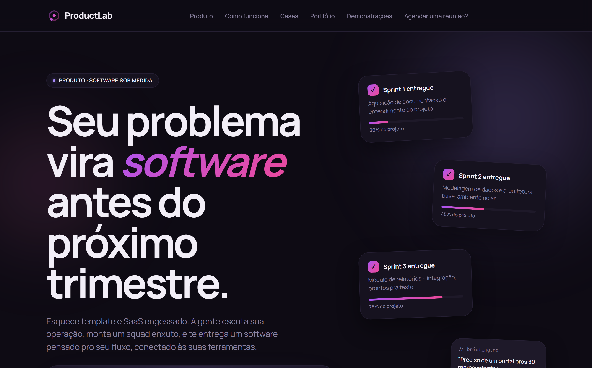

# ProductLab — Landing Page

Marketing landing page for **ProductLab**, a custom-software studio. It presents the studio's offer, a sprint-based delivery process, and a set of real client case studies with autoplaying video.

🔗 **Live:** [productlabsoftware.com.br](https://productlabsoftware.com.br/)



## Features

- **Animated case studies** — showcase videos for real projects (Barber Book, Mundo Pet, Rental Dental, Technik).
- **Sprint timeline** — communicates the delivery process ("Sprint 1 entregue", "Sprint 2 entregue", …).
- **Call-to-action** — meeting-scheduling section for leads.
- **Server-side rendered** — fast first paint and good SEO via TanStack Start.

## Tech stack

- **Framework:** [TanStack Start](https://tanstack.com/start) (React, full-stack with SSR)
- **UI:** shadcn/ui (Radix primitives) + Tailwind CSS
- **Build/runtime:** Vite, Bun
- **Origin:** scaffolded in [Lovable](https://lovable.dev/)

## Getting started

```bash
bun install
bun run dev        # local dev server
bun run build      # production build
```

## Case-study capture

Case videos live in `public/cases/<case>/`. The helper script records them from live URLs:

```bash
# configure scripts/cases.config.json first (see cases.config.example.json)
node scripts/capture-cases.mjs
```

## Deployment

This is **not** a static site — SSR needs a running Node process. It's deployed on a VPS behind nginx (HTTPS) with the Node server kept alive by PM2. See [`DEPLOY.md`](./DEPLOY.md) for the full setup.
